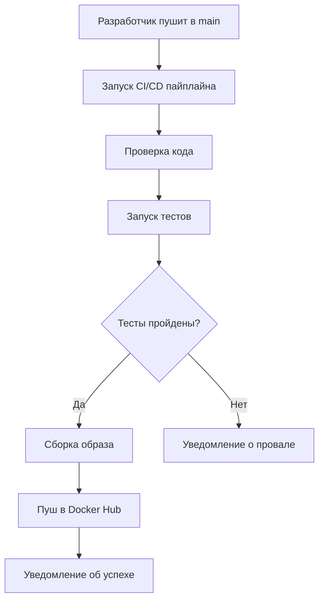

# Задание B3: "Объясни концепцию" (CI/CD)

## Автоматическая сборка Docker-образа при пуше в main

### Схема CI/CD пайплайна

```mermaid
graph TD
    A[Разработчик пушит в main] --> B[Запуск CI/CD пайплайна]
    B --> C[Проверка кода]
    C --> D[Запуск тестов]
    D --> E{Тесты пройдены?}
    E -->|Да| F[Сборка образа]
    E -->|Нет| G[Уведомление о провале]
    F --> H[Пуш в Docker Hub]
    H --> I[Уведомление об успехе]
     I
```
## Автор
Dushkin Aleksandr